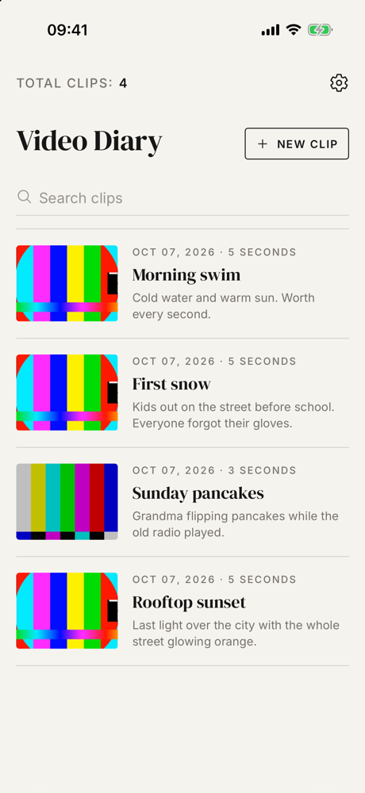
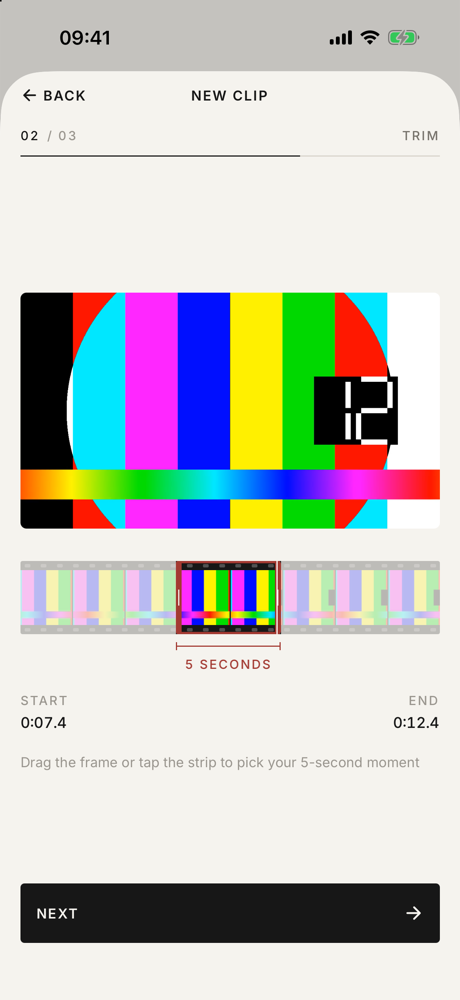
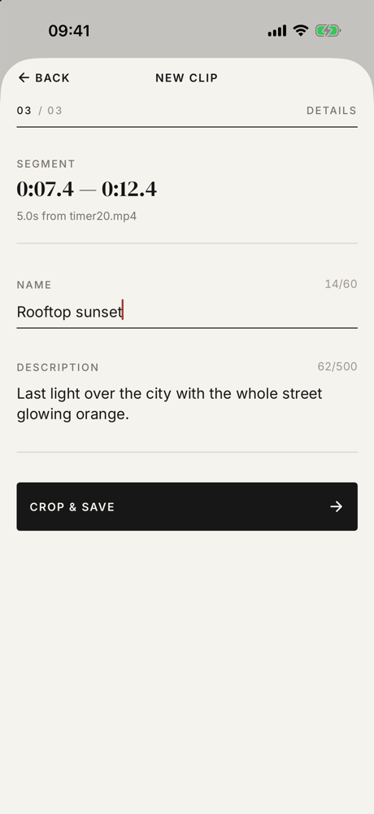
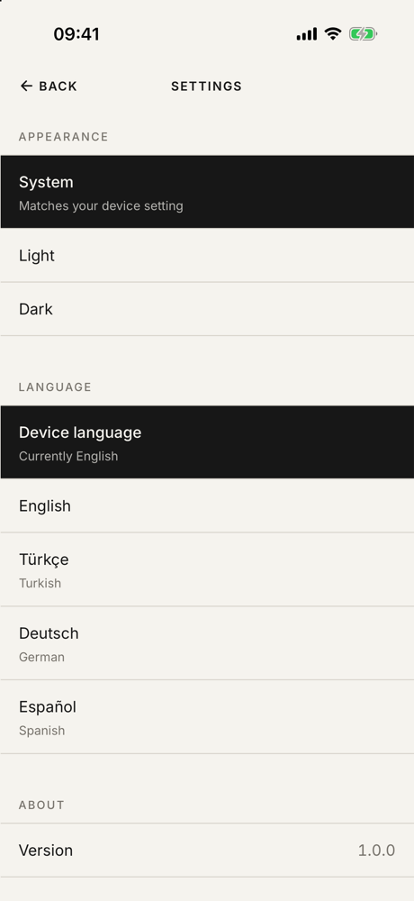

# Video Diary

A React Native (Expo) app for keeping a diary of short video moments: import a video, pick the
5 seconds that matter, give them a name and description, and come back to them anytime.

Built for the SevenApps React Native case study.

| Clip list | Trim | Details | Settings |
| :---: | :---: | :---: | :---: |
|  |  |  |  |

## Contents

- [Features](#features)
- [Tech stack](#tech-stack)
- [Getting started](#getting-started)
- [Project structure](#project-structure)
- [Testing](#testing)
- [Supported devices](#supported-devices)
- [Known limitations](#known-limitations)
- [License](#license)

## Features

- **Clip list**: paged list of saved clips with the total count and a search over names and
  descriptions.
- **Crop in three steps**: pick a video from the library, drag a 5-second window along a film
  strip with a live looping preview, then add a name and description.
- **Background cropping**: the modal closes right away and a *Cropping…* row tracks the job.
  Failed crops can be retried or dismissed, and several crops can run at once.
- **Details**: play a clip, edit its name and description, or delete it.
- **Settings**: light, dark or system theme, and English, Türkçe, Deutsch or Español, applied
  instantly and remembered.
- **Deep links**: `videodiary://videos/<id>` opens any clip, even one not loaded in the list yet.

## Tech stack

| Concern | Choice |
| --- | --- |
| Framework | Expo SDK 57 (React Native 0.86, React 19, React Compiler), TypeScript |
| Navigation | Expo Router with typed routes |
| State | Zustand (app state), TanStack Query (async writes and background crops) |
| Storage | Expo SQLite (clips, migrations, paging), `expo-file-system` (video and poster files) |
| Video | `expo-trim-video` (cropping), `expo-video` (playback, film strip), `expo-image-picker` |
| UI | NativeWind 4, Reanimated 4, Gesture Handler, FlashList, `expo-image` |
| Forms | react-hook-form with Yup |
| i18n | i18next, react-i18next, `expo-localization` |
| Testing | Jest (`jest-expo`), React Native Testing Library |

## Getting started

### Prerequisites

- Node 20+ and npm
- **iOS**: Xcode 26.4 or newer with an iOS simulator runtime, and CocoaPods
- **Android**: Android Studio with an emulator or a device

`expo-trim-video` is a native module that isn't part of Expo Go, so the app runs as a
**development build**.

### Install and run

```bash
npm install
npx expo run:ios       # or: npx expo run:android
```

`expo run:*` generates the native projects, builds and installs the app, and starts Metro.
After that, `npm start` is enough until native dependencies change.

> **Tip**: to add test videos to an iOS simulator, drag a file onto its window or run
> `xcrun simctl addmedia booted path/to/video.mp4`. If CocoaPods fails with an encoding error,
> run the build with `LANG=en_US.UTF-8`.

### Scripts

| Command | Description |
| --- | --- |
| `npm start` | Start Metro for an installed development build |
| `npm run ios` / `npm run android` | Build and run the native app |
| `npm test` | Run the tests (`test:watch`, `test:coverage` also available) |
| `npm run typecheck` | Type-check with `tsc` |
| `npm run lint` | Lint with ESLint (Expo config and React Compiler rules) |

## Project structure

```
src/
├── app/          # Expo Router screens: list, clip details, edit, settings, 404
├── components/
│   ├── commons/   # Generic building blocks: Typography, Button, Input, Sheet, MediaItem, …
│   └── specifics/ # App components built from commons: CropModal, TrimScrubber, VideoEntry, …
├── hooks/        # Mutations, background crop jobs, media player and trim playback hooks
├── services/     # Self-contained service classes and the app's instances
├── stores/       # Zustand store factories and the crop draft
├── i18n/         # Translations (en, tr, de, es) and language detection
├── lib/          # Pure helpers: time and segment math, validation, theme palette, …
├── setup/        # Startup work: saved preferences, daily file clean-up
└── testing/      # Test builders, render helpers and service fakes
```

Services are small, injectable classes; stores are factories wired together in one place
(`services/instances`); SQLite is the source of truth with keyset pagination; the UI is built
from generic components filled with app data. See **[docs/ARCHITECTURE.md](docs/ARCHITECTURE.md)**
for the layers, data flow, design system and the details behind the trim screen.

## Testing

```bash
npm test
```

Jest with the `jest-expo` preset and React Native Testing Library. The tests cover the
behaviour the app depends on: segment math and validation, the crop pipeline and its
rollback, SQL generation and migrations, paging and search in the store, background crop jobs,
deep-link loading, the trim preview loop, and the crop steps and forms as a user drives them.
Testing conventions are described in [docs/ARCHITECTURE.md](docs/ARCHITECTURE.md#testing-conventions).

## Supported devices

- **iOS**: iPhone and iPad on iOS 16.4 or newer
- **Android**: phones and tablets on Android 7.0 (API 24) or newer

## Known limitations

- The selected segment always has a fixed length (5 s, or the whole video if it's shorter);
  you choose where it starts, not how long it is.
- Clips live in the app's own storage, so deleting the app deletes the diary.
- No web support, as `expo-trim-video` is native-only.
- System screens such as the video picker use the device language, not the in-app one.
- **Android trim accuracy**: on Android, `expo-trim-video` copies samples without re-encoding,
  so the video starts at the nearest keyframe while the audio starts at the selected time.
  With sparse keyframes, the clip can open on a frozen frame and end a few frames early. iOS
  re-encodes and is frame-accurate. The case asks for `expo-trim-video`, so it is used
  unmodified; fixing this would mean re-encoding inside the library (e.g. with Media3
  Transformer).

## License

[MIT](LICENSE)
